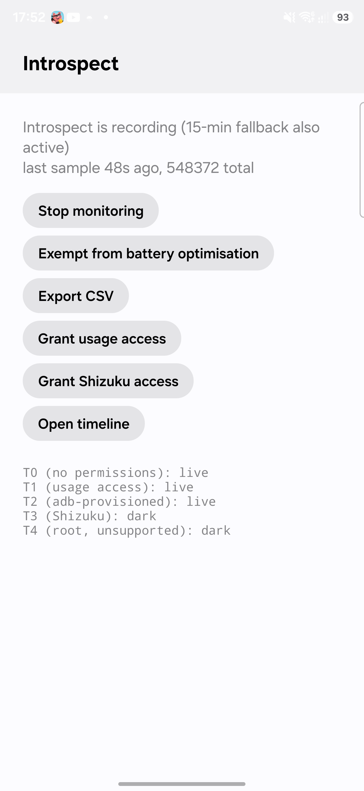
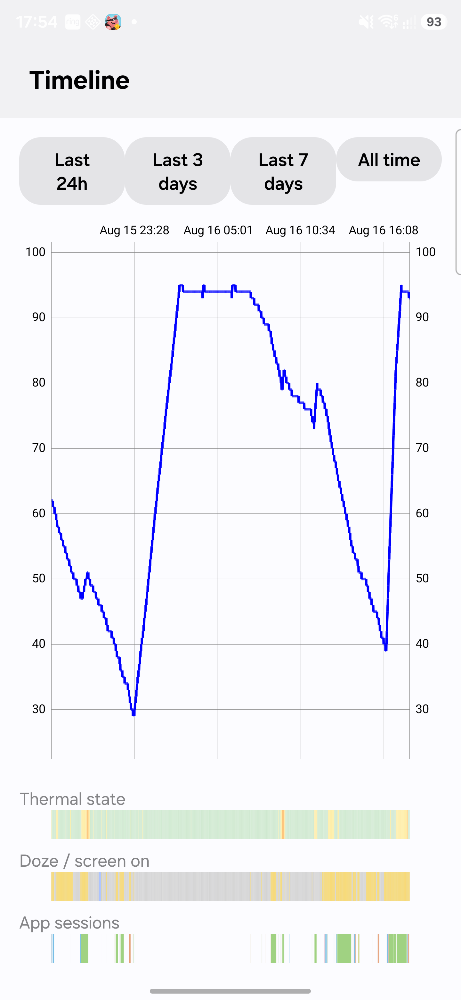
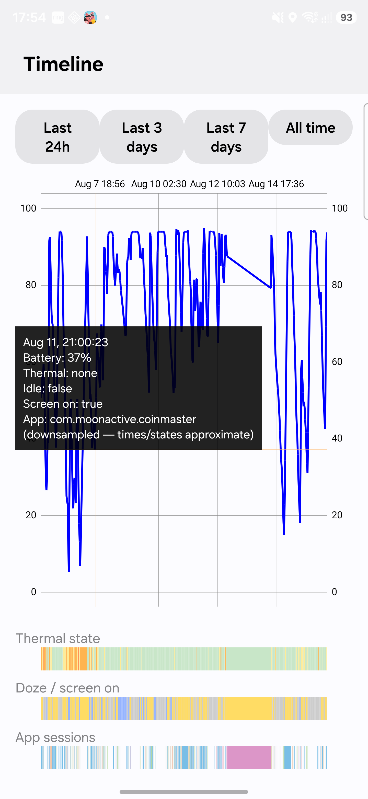

# phone-introspection
monitors phone for battery cpu and temp usage to help diagnose overheating issues

See [spec.md](spec.md) for the design and [STATUS.md](STATUS.md) for where things currently stand.

## Screenshots

### Main screen

Shows whether monitoring is running (with the 15-min WorkManager fallback noted alongside the foreground service), the last sample time and running total, and controls to start/stop monitoring, request battery-optimisation exemption, export CSV, grant usage/Shizuku access, and open the timeline. The bottom block lists each collector tier (T0–T4) and whether it's currently live, based on which permissions have been granted.

### Timeline — last 24h

The main battery-percentage line chart, with three colored bands underneath aligned to the same time axis: **thermal state** (green = normal, orange/red = throttling), **doze / screen-on** (yellow = screen on, grey = doze idle), and **app sessions** (each color a different foreground app). Range buttons at the top (24h/3d/7d/all) switch the window; the chart itself supports pinch-zoom and pan.

### Timeline — all time, with tap-to-inspect

Tapping anywhere on the chart drops a marker with the exact battery %, thermal state, doze/idle state, screen state, and foreground app at that point in time. Wider ranges like "All time" are SQL-downsampled for performance, which the marker's "(downsampled — times/states approximate)" note makes explicit.
